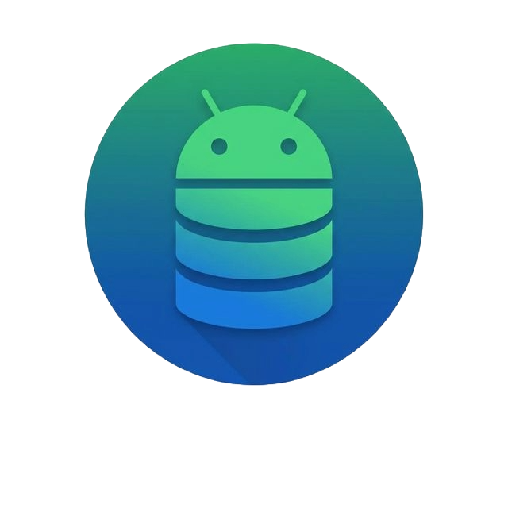
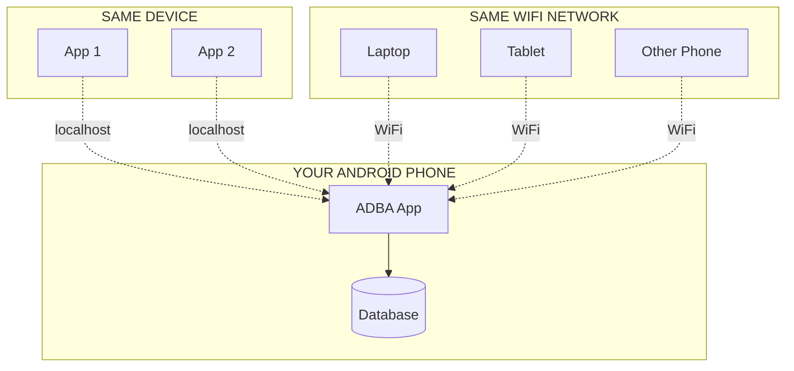
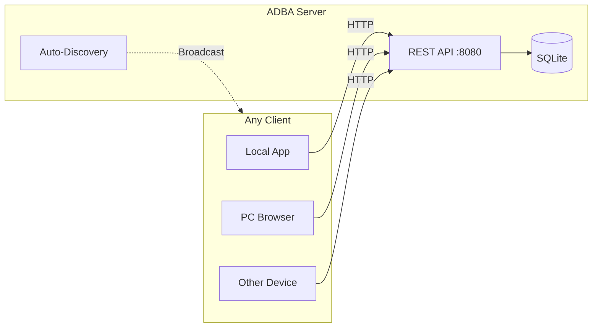

<p align="center">
  
</p>

<h1 align="center">ADBA</h1>
<h3 align="center">Android Database Application</h3>

<p align="center">
  <strong>Turn your Android phone into a local database server</strong>
</p>

<p align="center">
  <a href="#concept">Concept</a> |
  <a href="#how-it-works">How it Works</a> |
  <a href="#quick-start">Quick Start</a> |
  <a href="#api">API</a>
</p>

---

## Concept



> **One phone = One database server**  
> Any app (local or on network) can store and query data

---

## How it Works



---

## Architecture


---

## Quick Start

```bash
# Clone
git clone https://github.com/Garletz/ADBA-ANDROIDATABASE.git
cd ADBA-ANDROIDATABASE

# Install
npm install

# Dev (desktop)
npm run tauri dev
```

### Android APK
> Built automatically via GitHub Actions  
> Download from [Actions > Artifacts](../../actions)

---

## API

| Endpoint | Method | Description |
|:---------|:------:|:------------|
| `/api/status` | GET | Server status |
| `/api/databases` | GET | List all DBs |
| `/api/databases` | POST | Create DB |
| `/api/query` | POST | Execute SQL |
| `/api/pairing-code` | GET | Get connection code |

### Example

```bash
# Create database
curl -X POST http://PHONE_IP:8080/api/databases \
  -d '{"name": "myapp", "client_app": "MyApp"}'

# Query
curl -X POST http://PHONE_IP:8080/api/query \
  -d '{"database": "myapp", "query": "SELECT * FROM users", "pairing_code": "XXXX"}'
```

---

## Tech Stack

| Component | Technology |
|:----------|:-----------|
| Backend | Rust + Tauri |
| Database | SQLite (rusqlite) |
| API | Axum |
| Frontend | React + TypeScript |
| Discovery | mDNS |

---

<p align="center">
  <sub>Made for offline-first apps</sub>
</p>
