<p align="center">
  
</p>

<h1 align="center">ADBA</h1>
<h3 align="center">Android Database Application</h3>

<p align="center">
  <strong>Turn your Android phone into a local database server</strong>
</p>

<p align="center">
  <a href="#how-it-works">How it Works</a> •
  <a href="#quick-start">Quick Start</a> •
  <a href="#api">API</a>
</p>

---

## How it Works

```mermaid
flowchart LR
    subgraph LAN["📶 Local Network"]
        PC["💻 PC"]
        Tablet["📱 Tablet"]
        Other["🖥️ Other Apps"]
    end
    
    subgraph Android["📱 ADBA Server"]
        API["REST API"]
        SQLite[(SQLite)]
    end
    
    PC -->|HTTP| API
    Tablet -->|HTTP| API
    Other -->|HTTP| API
    API --> SQLite
```



> **Any device on your network can query the database via REST API**

---

## Architecture

```mermaid
flowchart TB
    subgraph Frontend["React Dashboard"]
        UI["📊 Status & Controls"]
    end
    
    subgraph Backend["Rust Backend"]
        Server["🌐 Axum REST"]
        DB["🗄️ SQLite Engine"]
        mDNS["📡 LAN Discovery"]
    end
    
    UI --> Server
    Server --> DB
    Server --> mDNS
```



---

## Quick Start

```bash
# Clone
git clone https://github.com/Garletz/ADBA-ANDROIDATABASE.git
cd ADBA-ANDROIDATABASE

# Install
npm install

# Dev (desktop)
npm run tauri dev
```

### 📱 Android APK
> Built automatically via GitHub Actions  
> Download from [Actions → Artifacts](../../actions)

---

## API

| Endpoint | Method | Description |
|:---------|:------:|:------------|
| `/api/status` | GET | Server status |
| `/api/databases` | GET | List all DBs |
| `/api/databases` | POST | Create DB |
| `/api/query` | POST | Execute SQL |
| `/api/pairing-code` | GET | Get connection code |

### Example

```bash
# Create database
curl -X POST http://PHONE_IP:8080/api/databases \
  -d '{"name": "myapp", "client_app": "MyApp"}'

# Query
curl -X POST http://PHONE_IP:8080/api/query \
  -d '{"database": "myapp", "query": "SELECT * FROM users", "pairing_code": "XXXX"}'
```

---

## Tech Stack

| Component | Technology |
|:----------|:-----------|
| Backend | Rust + Tauri |
| Database | SQLite (rusqlite) |
| API | Axum |
| Frontend | React + TypeScript |
| Discovery | mDNS |

---

<p align="center">
  <sub>Made with ❤️ for offline-first apps</sub>
</p>
